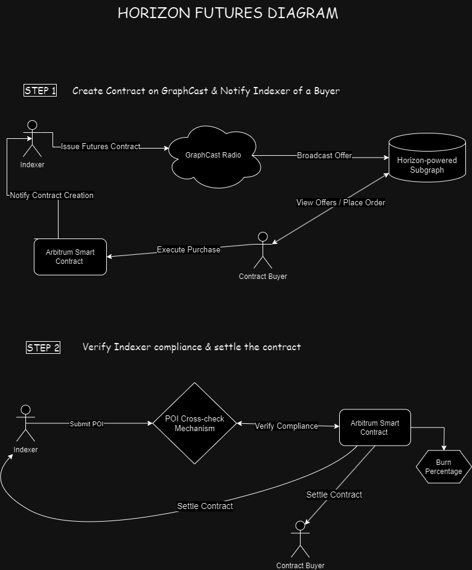

# Horizon Futures 

Horizon Futures is a decentralized application (dApp) prototype built on Arbitrum, designed to facilitate futures contracts between The Graph Indexers and buyers. This project is currently a prototype and integrates with The Graph's existing infrastructure.

## Overview

This prototype demonstrates a system for creating, managing, and settling futures contracts for The Graph Indexers. It aims to enhance the ecosystem by providing a way for indexers to secure future income and for buyers to lock in indexing services.

## Key Features

- Smart contract for futures contracts between Indexers and buyers
- Integration with The Graph's GRT token and staking mechanism
- Basic staking functionality for Indexers
- Creation, cancellation, and settlement of futures contracts
- Simple Proof of Indexing (POI) submission (placeholder for future Graphcast integration)

## Components

### Smart Contract (Rust / Arbitrum Stylus SDK)

The main contract, `IndexerFuturesContract`, manages futures and stakes. It includes:

- Staking mechanism for Indexers
- Future creation, cancellation, and settlement functions
- Basic POI submission (to be expanded in future versions)
- Integration with The Graph's existing contracts

## Next Steps

- Full integration with Graphcast for decentralized POI validation
- Implementation of a decentralized performance oracle
- Enhanced dispute resolution mechanism
- Comprehensive testing and security audit
- Development of a user-friendly frontend

